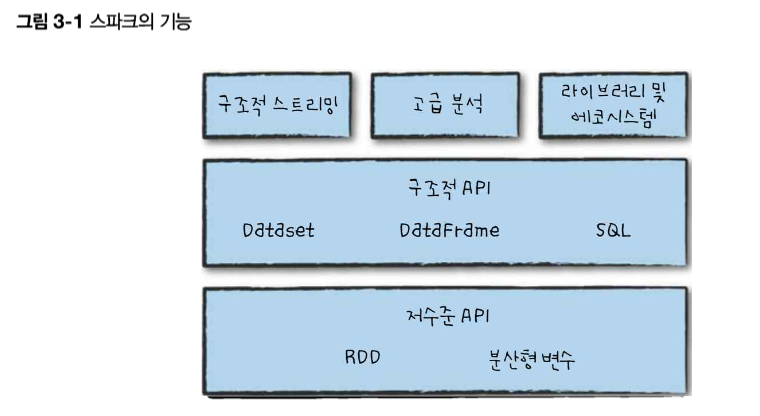

# Chapter 3. 스파크 기능 둘러보기

- 스파크는 `저수준 API`, `구조적 API`, `표준 라이브러리` 등으로 구성되어있습니다.


 <예시>
- `구조적 API` : 포숫 (합쳐져 있는것)
- `저수준 API` : 포크 + 숫가락
- `라이브러리` : 그래프 분석, 머신러닝, 스트리밍등 다양한 작업 지원

## 3.1 운영용 애플리케이션 실행
- `spark-submit` 명령을 통해 애플리케이션 코드를 클러스터에 전송해 실행시키는 역할을 함.
- `스파크 어플리케이션` : `스탠드얼론`, `메소스`, `YARN 클러스터 매니저`를 이용해 실행됨

<예제: pi값을 특정 자릿수까지 계산>

---

- 스파크를 내려받은 디렉터리에서 다음 코드를 실행 #Linux(SPRK_HOME)

```python

./bin/spark-submit\
--master local \
./examples/src/main/python/pi.py 10

- `spark-submit`명령에 예제 클래스를 지정, 로컬 머신에서 실핼되도록 설정, JAR파일관련 인수도 함께 지정
```
    
---

## 3.2 Dataset: 타입 안정성을 제공하는 구조적 API
- `Dataset` : 자바, 스칼라등 정적 데이터 타입에 맞는코드 `정적 타입 코드`(C++, C, 자바)를 지원하기 위해 고안된 스파크의 구조적 API. 
- `DataFrame` : 다양한 데이터 타입의 테이블형 데이털르 보관할 수 있는 Row타입의 객체로 구성된 분산 컬렉션
- `Dataset API` : `타입 안정성` 지원하므로, 초기화에 사용한 클래스 대신 다른 클래스를 사용해 접근 불가
    - 예시: Dataset[Person]은 Person 클래스의 객체만 가질 수 있습니다.
- `Dataset`은 필요한 경우에 선택적으로 사용가능. 즉, 데이터 타입을 정의하고 map, filter 함수 사용 가능.
- `Dataset`은 collect 메서드, take 메서드를 호출 시, Row타입의 객체가 아닌, Dataset의 매개 변수로 지정한 타입의 객체를 변환

## 3.3 구조적 스트리밍 
- `구조적 스트리밍` 을 사용하면, 구조적 API로 개발된 배치 모드의 연산을 스트리밍 방식으로 실행, 지연시간을 줄이고 증분 처리 가증

---
    <예제: 소매점에서 생성된 데이터가 구조적 스트리밍 잡이 읽을 수 있는 저장소로 전송되고 있는 가정된 상황>


```python
# 정적 데이터셋의 데이터를 분석해 DataFrame생성
staticDataFrame = spark.read.format("csv")\
  .option("header", "true")\
  .option("inferSchema", "true")\
  .load("./data/retail-data/by-day/*.csv")

staticDataFrame.createOrReplaceTempView("retail_data")
staticSchema = staticDataFrame.schema
```
---

    <time-series 데이터이기 때문에, 그룹화 하고 집계>

---
```python
# 특정 고객(CustomerId로 구분) 이 대량으로 구매하는 영업시간을 살펴봄
# 총 구매비용 컬럼을 추가하고 그 고객이 가장 많이 소비한 날을 찾아봄
from pyspark.sql.functions import window, column, desc, col
staticDataFrame\
  .selectExpr(
    "CustomerId",
    "(UnitPrice * Quantity) as total_cost",
    "InvoiceDate")\
  .groupBy(
    col("CustomerId"), window(col("InvoiceDate"), "1 day"))\
  .sum("total_cost")\
  .show(5)

#결과
+----------+--------------------+-----------------+
|CustomerId|              window|  sum(total_cost)|
+----------+--------------------+-----------------+
|   16057.0|[2011-12-05 09:00...|            -37.6|
|   14126.0|[2011-11-29 09:00...|643.6300000000001|
|   13500.0|[2011-11-16 09:00...|497.9700000000001|
|   17160.0|[2011-11-08 09:00...|516.8499999999999|
|   15608.0|[2011-11-11 09:00...|            122.4|
+----------+--------------------+-----------------+
```

---


---
```python
# 기본값 200인, 셔플 파티션 수를 5로 변경
spark.conf.set("spark.sql.shuffle.partitions", "5")
```
---

---
```python
#<스크리밍 코드!!!, read대신 readStream 메서드, maxFilesPerTrigger 옵션 사용>
streamingDataFrame = spark.readStream\
    .schema(staticSchema)\
    .option("maxFilesPerTrigger", 1)\
    .format("csv")\
    .option("header", "true")\
    .load("./data/retail-data/by-day/*.csv")
```
---


---
```python
# DataFrame이 스트리밍 유형인지 확인
streamingDataFrame.isStreaming 
# true반환
```
---


---
```python
# 총 판매 금액 계산
purchaseByCustomerPerHour = streamingDataFrame\
  .selectExpr(
    "CustomerId",
    "(UnitPrice * Quantity) as total_cost",
    "InvoiceDate")\
  .groupBy(
    col("CustomerId"), window(col("InvoiceDate"), "1 day"))\
  .sum("total_cost")

```
---


    - lazy 연산이므로 데이터 플로를 실행하기 위해 스트리밍 액션을 호출해야한다!!!
    - 스트리밍 액션은 트리거가 실행된 다음 데이터를 갱신하게 될 인메모리 테이블에 데이터를 저장
---
```python
# 파일마다 트리거를 실행, 스파크는 이전 집계값보다 더 큰 값이 발생한 경우에만 인메모리 테이블을 갱신하므로 언제나 가장 큰 값을 얻음
purchaseByCustomerPerHour.writeStream\
    .format("memory")\
    .queryName("customer_purchases")\
    .outputMode("complete")\
    .start()
```
---


---
```python
#인메모리 테이블에 기록되는지 확인
spark.sql("""
  SELECT *
  FROM customer_purchases
  ORDER BY `sum(total_cost)` DESC
  """)\
  .show(5)

#결과
+----------+--------------------+-----------------+
|CustomerId|              window|  sum(total_cost)|
+----------+--------------------+-----------------+
|      null|[2011-11-16 09:00...|17518.40999999992|
|   12415.0|[2011-03-03 09:00...|         16558.14|
|   15769.0|[2011-03-17 09:00...|          10065.0|
|   17450.0|[2011-11-03 09:00...|          9069.82|
|      null|[2011-03-17 09:00...|7876.000000000018|
+----------+--------------------+-----------------+
only showing top 5 rows

```
- 고객을 그룹화 하기 때문에, 시간이 지남에 따라 일정시간이 지남에 따라 일정기간 최고로 많이 구매한 고객의 구매 금액이 증가할것으로 기대가능
- 스파크가 데이터를 처리하는 시점이 아닌 이벤트 시간에 따라 윈도우를 구성하는 방식에 주목할 필요가 있다. 이를 통해 `기존 스파크 스트리밍`의 단점을 `구조적 스트리밍`으로 보완가능
---


## 3.4 머신러닝과 고급분석
- 내장된 머신러닝 알고리즘 라이브러리 `MLib`을 사용해 대규모 머신러닝 수행가능


    <예제: 원본 데이터를 올바른 포맷으로 만드는 트랜스포메이션을 정의, 실제로 모델을 학습한 다음 예측을 수행>
---
```python
# 데이터 타입확인
staticDataFrame.printSchema()


#결과

root
 |-- InvoiceNo: string (nullable = true)
 |-- StockCode: string (nullable = true)
 |-- Description: string (nullable = true)
 |-- Quantity: integer (nullable = true)
 |-- InvoiceDate: timestamp (nullable = true)
 |-- UnitPrice: double (nullable = true)
 |-- CustomerID: double (nullable = true)
 |-- Country: string (nullable = true)
```
---


---
    <다양한 데이터 타입을 수치형으로 변환>
```python
# DataFrame 트랜스포메이션을 사용해 날짜 데이터를 수치형으로 변환
from pyspark.sql.functions import date_format, col
preppedDataFrame = staticDataFrame\
  .na.fill(0)\
  .withColumn("day_of_week", date_format(col("InvoiceDate"), "EEEE"))\
  .coalesce(5)

```
---


---
```python
# train_set / test_set 으로 분리

trainDataFrame = preppedDataFrame\
  .where("InvoiceDate < '2011-07-01'")
testDataFrame = preppedDataFrame\
  .where("InvoiceDate >= '2011-07-01'")

# 액션을 호출하여 데이터 분리, 결과값 확인
trainDataFrame.count()
testDataFrame.count()
```
---


---
```python
# 트랜스포메이션을 자동화하는 `StringIndexer` 사용
from pyspark.ml.feature import StringIndexer
indexer = StringIndexer()\
  .setInputCol("day_of_week")\
  .setOutputCol("day_of_week_index")
```
---

<요일을 수치형으로 반환, 월요일:1, 일요일:7 등등, 하지만 7 > 1 을 의미하기 때문에 `OneHotEncoder`를 사용해 각 값을 자체 컬럼으로 인코딩>

---
```python
# OneHotEncoder를 통해 특정요일을 Boolean 타입으로 표현
from pyspark.ml.feature import OneHotEncoder
encoder = OneHotEncoder()\
  .setInputCol("day_of_week_index")\
  .setOutputCol("day_of_week_encoded")

```
---

<스파크의 모든 머신러닝 알고리즘은 `수치형 벡터 타입`을 입력으로 사용!>

---
```python
# Vectorize
from pyspark.ml.feature import VectorAssembler

vectorAssembler = VectorAssembler()\
  .setInputCols(["UnitPrice", "Quantity", "day_of_week_encoded"])\
  .setOutputCol("features")
```
---

<세 가지 핵심 특징, UnitPrice, Quantity, day_of_week_encoded 등 나중에 입력값으로 들어올 데이터가 같은 프로세스를 거쳐 변환되도록 `파이프라인` 설정>

---
```python
#파이프라인 설정
from pyspark.ml import Pipeline

transformationPipeline = Pipeline()\
  .setStages([indexer, encoder, vectorAssembler])

```
---

<학습 준비과정 2단계. a) `변환자(transformer)`를 데이터에 적합. StringIndexer는 인덱싱할 고윳값의 수를 알아야함. 고윳값의 수를 알 수 있다면 인코딩이 매우 쉽지만, 알 수 없다면 컬럼에 있는 모든 고윳값을 조사하고 인덱싱해야한다.

---
```python
# 변환자를 데이터셋에 fit
fittedPipeline = transformationPipeline.fit(trainDataFrame)

```
---

< b)fit 이후 학습을 위해 준비된 `맞춤 파이프라인(fitted pipeline)`을 사용해, 일관적 반복적인 방식으로 모든 데이터 변환>

---
```python
transformedTraining = fittedPipeline.transform(trainDataFrame)

```
---

<`캐싱`을 사용해 중간 변환된 데이터셋의 복사본을 메모리에 저장, 전체 파이프라인 재실행 하는것보다 훨씬 빠르게 반복적 데이터셋 접근가능>

---
```python
# 캐싱사용
transformedTraining.cache()

#결과값
DataFrame[InvoiceNo: string, StockCode: string, Description: string, Quantity: int, InvoiceDate: timestamp, UnitPrice: double, CustomerID: double, Country: string, day_of_week: string, day_of_week_index: double, day_of_week_encoded: vector, features: vector]

```
---


---
```python
# 모델학습을 위해, 관련 클래스를 임포트하고 인스턴스 생성
from pyspark.ml.clustering import KMeans
kmeans = KMeans().setK(20).setSeed(None)
```
---

<스파크의 머신러닝 모델학습 과정은 2단계. a) 아직 학습되지 않은 모델 초기화, b) 해당 모델을 학습>

- 학습 전 알고리즘 명칭: `Algorithm`
- 학습 후 알고리즘 명징: `AlgorithModel`

---
```python
# 모델학습
kmModel = kmeans.fit(transformedTraining)
```
---


---
```python
# 학습 데이터셋에 대한 비용을 계산

kmModel.computeCost(transformedTraining)

transformedTest = fittedPipeline.transform(testDataFrame)
kmModel.computeCost(transformedTest)

```
- 예제에서 사용한 데이터셋의 군집 비용은 상당히 높은 편. 전처리와 표준화 작업이 적절히 이루어지지 않았기 때문. 25장에서 자세히 살펴봄
---

## 3.5 저수준 API
- 스파크는 `RDD`를 통해 자바와 파이썬 객체를 다루는 데 필요한 다양한 기본 기능(저수준 API)제공
- `DataFrame` 연산도 RDD를 기반으로 만들어 졌고, 효율적인 분산 처리를 위해 저수준 명령으로 컴파일 됨
- 대부분 `구조적 API` 사용이 좋으나 `RDD`를 이용해 파티션과 같은 물리적 실행 특성을 결정할 수 있으므로 DataFrame보다 더 세밀한 제어 가능

---
```python
# 간단한 숫자를 이용해 RDD를 생성하는 예제, 이후 DataFrame과 함께 사용할 수 있도록 DataFrame으로 변환

from pyspark.sql import Row
spark.sparkContext.parallelize([Row(1), Row(2), Row(3)]).toDF()

```
---


## 3.6 SparkR
- 스파크를 R 언어로 사용하기 위한 기능.
- R 사용자는 magrittr의 pipe 연산자와 같은 R 라이브러리를 사용해, 스파크 트랜스포메이션 과정을 R과 유사하게 만드는것이 가능

## 3.7 스파크의 에코시트템과 패키지
- 스파크가 자랑하는 최고 장점!!!
- 다양한 패키지가 존재하고 계속해서 증가하고 있음
- `spark-packages.org` 및 `github` 같은 웹사이트에서 찾아볼 수 있음
