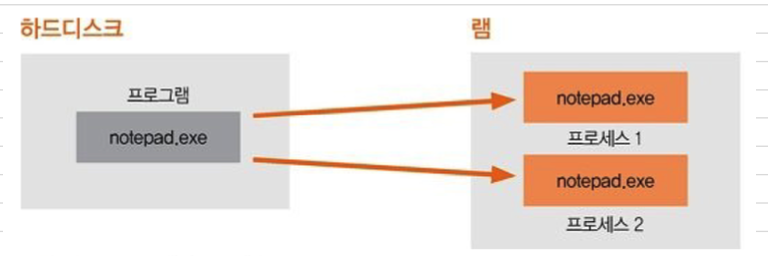
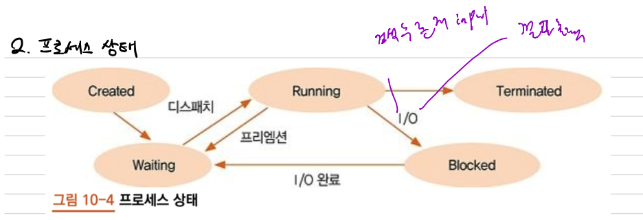
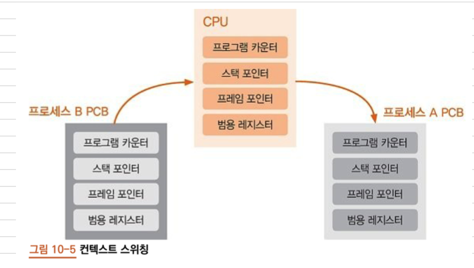
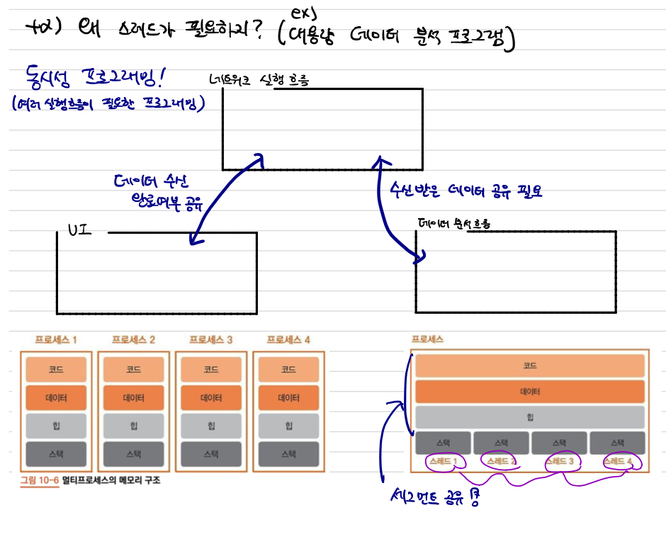
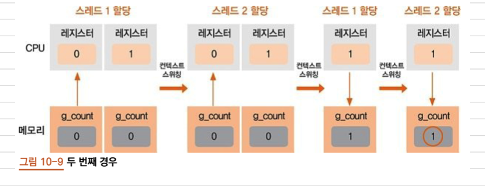

# 10장. 프로세스와 스레드

## 1. 프로세스

- 프로그램
    - 하드디스크에 저장된 실행파일. 더블 클릭 실행전까지 계속 하드디스크에 남아있음
- 프로세스 
    - 더블클릭으로 프로그램을 실행한 상태 즉, 하드디스크에서 메인 메모리로 코드와 데이터를 가져와 현재 실행한 상태
    - `동시에 독립적인 프로세스 여러 개 사용 가능`. (메모장 2개 키기). 
    - 프로세스는 계속해서 실행 상태로 있는 것이 아니라 상황에 따라 변함. 


### 1.1 프로세스 상태

- `CPU`는 한 번에 하나의 프로세스만 할당할 수 있다. `동시에 여러 프로세스 불가(우리눈에만 그렇게 보임)`
- `상황 `에 따라 프로세스 상태가 바뀜



- Created(생성) : 프로그램을 더블클릭했을 때, 프로세스가 생성되며, 실행가능 상태가 됨. 
- Waiting(실행 가능) : 언제든지 실행될 준비가 되어있음. 다음으로 실행될 프로세스에 CPU할당 하는것을 `디스패치`, CPU를 해제하는 것을 `프리엠션(preemption)` 이라고 함
- Running(실행) : CPU를 할당받아 실행되고 있음
- Blocked(보류) : 프로세스가 I/O(입출력) 작업하면 CPU해제하고 보류상태로 변경. I/O 작업이 모두 끝날 시 실행 가능 상태로 변경.
- Terminated(소멸) : 프로세스 실행이 완료되어 메인 메모리에서 사라짐
    

### 1.2 스케줄링

- 스케줄링
    - 운영 체제가 여러 프로세스의 CPU 할당 순서를 결정하는 것. 
    - 선점형 스케줄링 : 어떤 프로세스가 실행 중에 있어도 스케줄러가 강제로 실행을 중지하고 다른 포르세스에 CPU 할당가능. 
    - 비선점형 스케줄링 : 실행중인 프로세스가 종료되거나 I/O작업에 들어가거나 명시적으로 CPU를 반환하기 전까지 계속 실행.
    
### 1.2.1 스케줄링 알고리즘

- `우선순위 알고리즘` : 프로세스에 우선순위를 매겨 우선순위가 높은 프로세스를 먼저 실행
    - 기아 상태: 오랜시간 CPU를 할당받지 못한 상태
    - 에이징 기법: 오랜시간 CPU를 할당받지 못하면 우선순위를 높임
- `라운드 로빈 알고리즘` : 실행 가능 상태에 있는 프로세스들을 순서대로 가져와 일정 시간동안 CPU 할당
- FCFS(First Come First Served) : 실행 가능 상태에 먼저 들어온 프로세르를 먼저 실행
- SJF(Shortest Job First) : CPU 할당 시간이 가장 짧은 프로세스를 먼저 실행
    
### 1.3 컨텍스트 스위칭
    
- 컨텍스트 스위칭 

   
    - PCB : 프로세스의 CPU상태와 프로세스의 상태를 저장해 둔 메모리 블록. 
    - CPU상태를 컨텍스트라고 부르는데, 현재 CPU의 레지스터 값들을 전환 하는 것을 의미.
    - 잦은 컨텍스트 스위칭은 시스템 성능을 떨어트림. (PCB로 데이터를 저장하고, 가져오는 것은 시스템에 부담) 
    
## 2. 스레드

### 2.1 멀티프로세스와 멀티스레드
- 스레드
    - 프로세스 안의 실행 흐름 단위로 스케줄러에 의해 CPU를 할당받을 수 있는 인스트럭션의 나열.
    - 프로세스는 하나 이상의 스레드
    - 프로세스의 PCB와 같은 역할을 하는 TCB를 가짐.
    - 프로세스 상태와 컨텍스트 스위칭이 스레드에도 똑같이 적용. 
    
    


- 멀티프로세스와 멀티스레드
    - `여러 실행 흐름을 구현`하려면 멀티프로세스와 멀티스레드로 구현. 
    - 멀티 프로세스 구현
        
        - 각각의 프로세스는 서로 독립적인 메모리 공간을 가짐
        - 데이터 공유 불가능

    - 멀티 스레드 구현
        - 여러 스레드가 스택만 서로 다른 공간을 갖고 코드, 데이터, 힙은 공유
        - 데이터 세그먼트나 힙 세그먼트에 공유 데이터를 두면 모든 스레드가 이용 가능. 
        - 데이터 공유 가능
        
### 2.2 멀티스레딩 구현
예제 : 정수가 담긴 리스트의 모든 요소 값을 두배로 만들기
```python
# 단일 스레드
li = [i for i in range(1001)]
for idx in range(1001):
    li[idx] *= 2
```

# 4개의 실행 흐름을 가진 멀티스레드
```python
import threading

def thread_main(li, i):
    for i in range(offset*i, offset*(i+1)):
        li[i] *= 2
        
        
num_elem = 1000
num_thread = 4 
offset = num_elem // num_thread

li = [i+i for i in range(num_elem)]

threads = []
for i in range(num_thread):
    th = threading.Thread(target = thread_main, args = (li, i))  # target : 스레드에서 실행할 함수, args : 함수에 전달할 인자 
    threads.append(th)
    
for th in threads:
    # 스레드 실행 시작
    th.start()
for th in threads:
    # 스레드 실행 종료 대기 
    th.join()
    
print(li)
```

### 2.3 경쟁조건
- 여러 `스레드가 동시에 접근`, 수정, 공유 가능한 자원을 `공유 자원`이라고 함
- 선점형 스케줄링에서는 스레드1의 연산이 완전히 끝날 때까지 컨텍스트 스위칭을 기다려 주지 않는 경우가 발생할 수 있어서 실행결과가 예상한 값과 전혀 다른 결과가 나오기도 함. 
- 스레드 여러 개가 공유 자원에 동시에 접근하는 것을 `경쟁 조건`이라고 함.



```python
# 50개의 실행 흐름을 가진 멀티스레드 
import threading

g_count = 0 

def thread_main():
    global g_count    # 공유 자원
    for i in range(100000):
        g_count +=1 
        
threads=[]
for i in range(50):
    th = threading.Thread(target = thread_main)
    threads.append(th)
    
for th in threads:
    th.start()
    
for th in threads:
    th.join()
    
print('g_count : {:,}'.format(g_count))
```

### 2.4 상호 배제
- 경쟁 조건 문제를 해결하는 방법.
- 스레드 하나가 공유 자원을 이용하는 동안에는 `다른 스레드가 접근하지 못하게 막음`.
- 여러 스레드가 공유자원의 값을 변경하려하면 문제가 발생하며, 공유 자원에 접근해 변경을 시도하는 코드를 `임계영역`이라고 함. 
- 파이썬은 임계영역이 부분에서 `Lock 객체를 활용해 경쟁 조건 문제 해결`.

```python
import threading

g_count = 0

def thread_main():
    global g_count
    lock.acquire()  # 임계 영역이 시작되는 곳에서 acquire메서드로 Lock객체 획득. . 
    for i in range(100000):
        g_count +=1
    lock.release()  # 임계영역을 빠져나와 release메서드로 Lock객체 반환
    
lock = threading.Lock()   # Lock 객체 생성

threads=[]
for i in range(50):
    th = threading.Thread(target = thread_main)
    threads.append(th)

for th in threads:
    th.start()
    
for th in threads:
    th.join()
    
print("g_count:{:,}".format(g_count))
```

## 파이썬의 전역 인터프리터 락

- 파이썬의 전역 인터프리터 락(Global Interpreter Lock, GIL)은 상호 배제를 구현하는 한가지 방법인 뮤텍스(mutex)로 한번에 스레드 여러개의 바이트 코드를 실행하는것을 막아줍니다.
- GIL로 인해 멀티코어의 장점을 활용 못한다 해도, 멀티 스레딩은 여전히 동시실행에 대한 문제를 해결하는 좋은 방법입니다.
