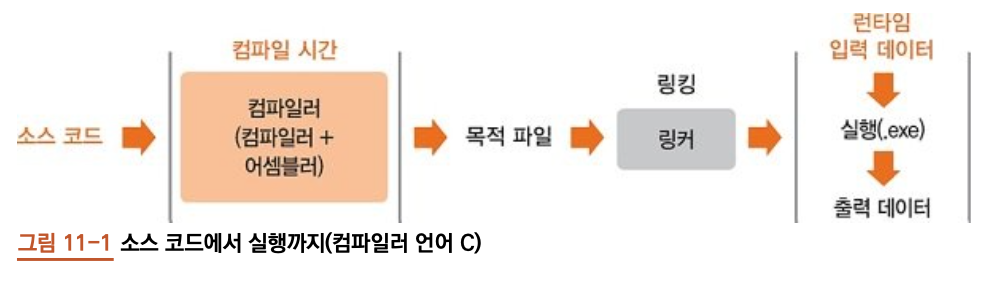
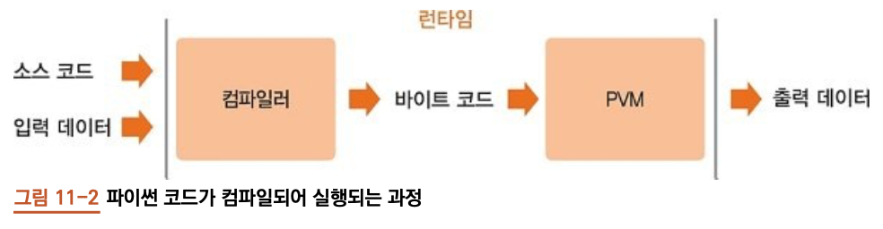
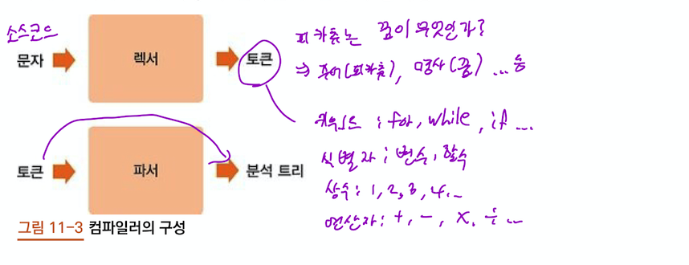
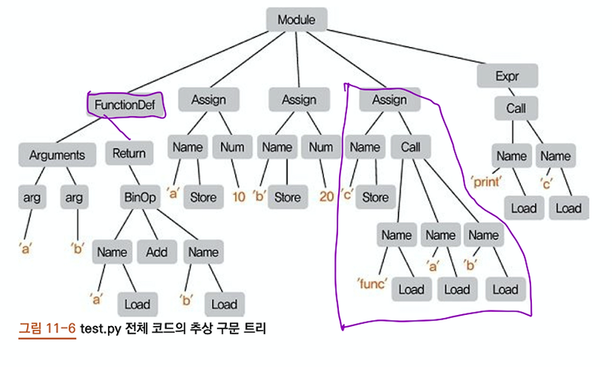
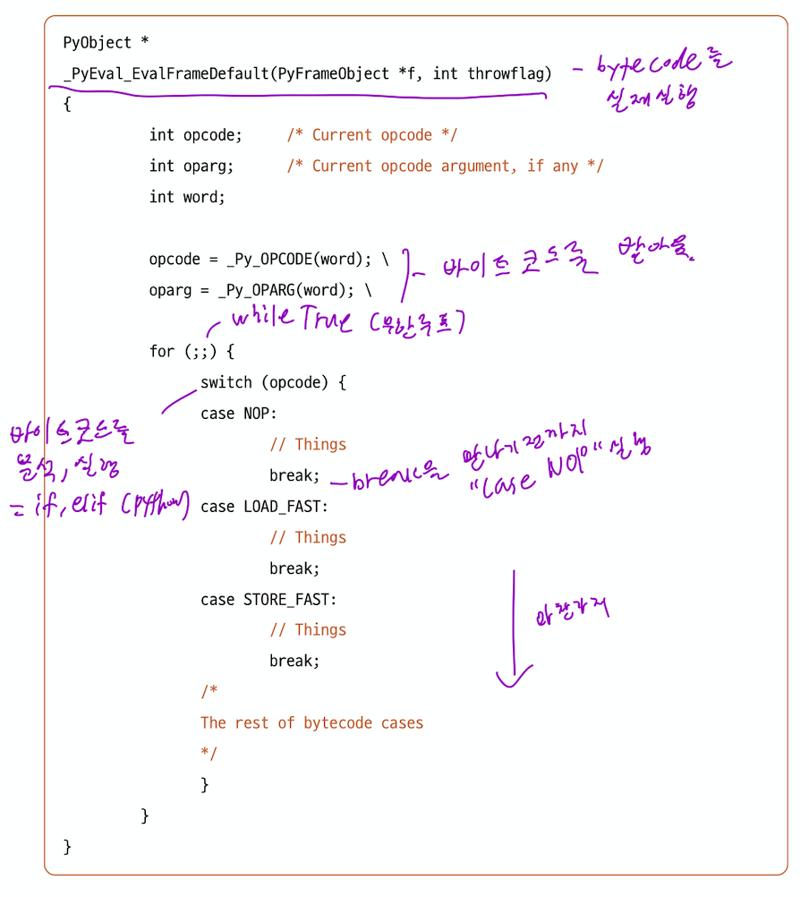

# 9장. 프로그래밍 언어

- `compiler(컴파일러)` - 특정 프로그래밍 언어로 쓰여있는 문서를 다른 프로그래밍 언어로 옮기는 프로그램
- `compile(컴파일)` - 소스코드(원래의 문서) -> 목적코드(하드웨어가 처리하기에 용이한 형태 or 사람이 읽을 수 있는 문서파일) 등으로 옮기는 과정
    < reference: wikipedia.org>

## 9.1 컴파일러 언어와 인터프리터 언어

- `컴파일러 언어` 와 `인터프리터 언어` 는 `컴파일 타임`의 유무에 따라 구분됩니다. 즉 소스 코드를 분석하는 시점과 입력 데이터를 받는 시점이 언제인가에 따라 나뉨.

### 9.1.1 C 언어: 컴파일러 언어 분석




### <font color="red"> 과정</font>
1. C 언어는 소스코드를 컴파일하여 `목적 코드(목적 파일)` 인 `기계어로 된 인스트럭션`을 만들어 냅니다.
2. `링커(linker)` : 필요한 라이브러리를 가져오고, 여러개의 `목적 파일` 을 함께 묶어 `실행파일` 생성
3. `실행` 후 `데이터 입력` 하면 결과 데이터 `출력`.
    * < 소스 코드를 분석하는 `compile time`과 실제 데이터를 입력받아 결과를 출력하는 `런타임`이 분리 >
    
### 9.1.2 파이썬: 인터프리터 언어 분석



### <font color="red"> 과정</font>
1. `소스코드` + `데이터`를 동시에 입력 받음 <font color="red">(컴파일러 언어와 가장 큰 차이!!)</font>
2. 분석하는 `컴파일러`가 있음 (허나 소스코드를 분석하는 컴파일 타임이 따로 없다. 실행과 동시에 분석 시작)
3. `바이트 코드 생성`
4. `PVM(Python Virtual Machine)` 에서 바이트 코드를 하나씩 해석하여 프로그램을 실행

## 9.2 파이썬: 소스 코드부터 실행

### 9.2.1 컴파일러



- 일반적 `컴파일러` : `렉서(lexer)` + `파서(parser)`로 구성됨
    1. `소스코드`는 `렉서`를 거쳐 여러개의 `토큰`<font color="red">(문장을 종류별로 쪼갠것)</font>으로 변경됨
    2. `토큰`은 `파서`를 통해 분석 트리(parse tree)로 구성됨
    3. `분석트리`를 이용해 `목적코드(바이트 코드)`를 생성함 = `코드 생성(code generation)`

### <파이썬의 `바이트 코드` 생성과정>

1. 소스코드 -> 분석 트리
2. 분석 트리 -> 추상 구문 트리
3. 심벌 테이블 생성
4. 추상 구문 트리 -> 바이트 코드

### 9.2.2 추상구문 트리(Abstract Syntax Tree, AST)

- 소스 코드의 구조를 나타내는 자료 구조
- `추상구문 트리`를 바탕으로 심벌 테이블을 만들고 바이트 코드를 생성합니다.

---
```python

# 자세한 test.py, 토크나이징이 궁금할 시 본 책 286pg참조

import ast
node = ast.parse(s, 'test.py', 'exec') #1
g = ast.walk(node) #2
next(g) # 첫번째 next(g)

next(g) #두번째 next(g)

```
---

- #1 노드를 생성후, #2 walk 함수를 통해, 트리의 모든 노드를 순회할 수 있는 발생자 객체 획득
- `발생자(generator)`는 함수를 실행 도중에 멈췄다가 원하는 시점에 다시 시작할 수 있도록 하는 함수.
---

###  전체 코드의 추상 구문 트리

<font color= "red">test.py</font>
```python
def func(a, b):
    return a + b

a = 10
b = 20
c = func(a, b)
print(c)
```


### 9.2.3 심벌 테이블(symbol table)

- 변수나 함수의 이름과 그 속성에 대해 기술해 놓은 테이블
- 상단의 `test.py`를 보면 `global` = a, b, c `func`, `print`를 심벌 테이블을 확인해 봅시다.

```python
>>> import symtable
>>> sym = symtable.symtable(s, "test.py", "exec') #1
>>> sym.get_name() #2
"top"
>>> sym.get_symbols() #3
```

- #1 symtable() 함수를 통해 테이블을 받아오고, 
- #2 이름을 확인합니다. `top` = 글로벌 이라는 의미 입니다.
- #3 getr_symbols() 함수로 현재 영역에 있는 심벌을 확인합니다.

### 9.2.4 바이트 코드와 PVM(Python Virtual Machine)

- `바이트 코드`는 파이썬의 가상 머신 위에서 실행 됩니다.
- `PVM`은 그저 굉장히 큰 무한 루프 입니다.



