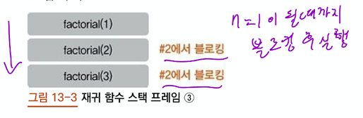
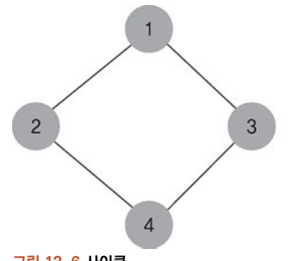
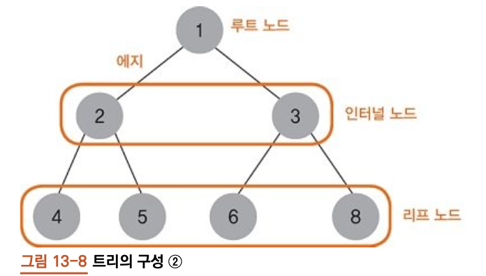
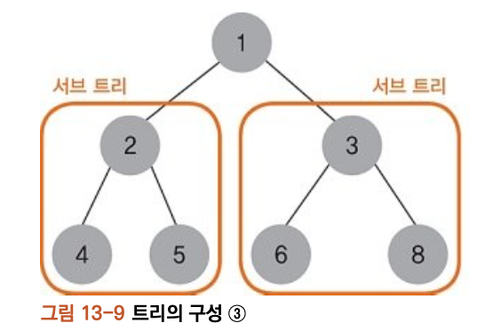
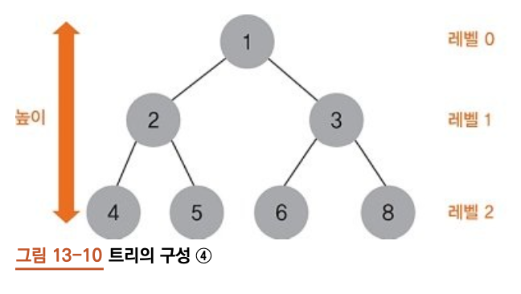
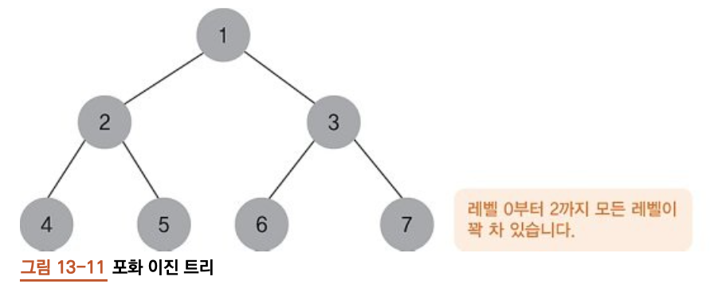
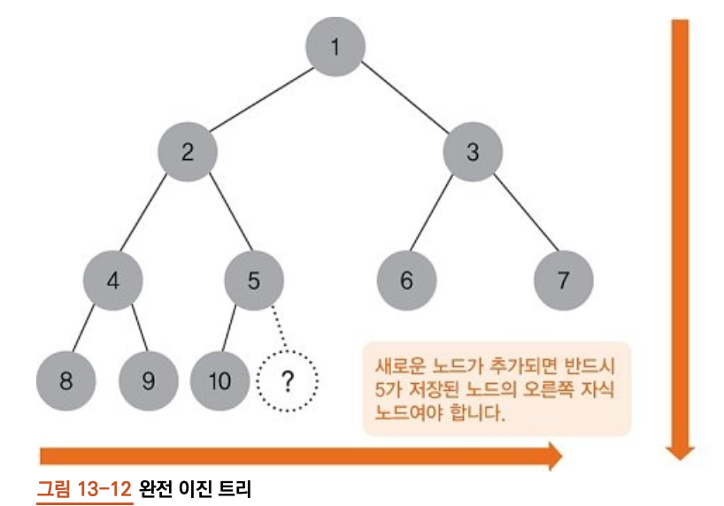
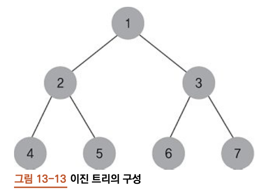
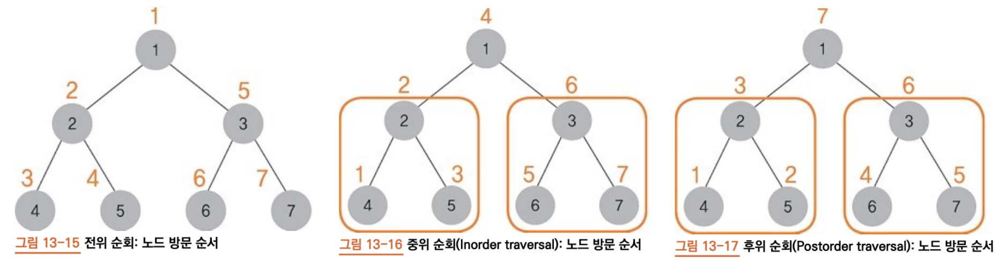

# 13. 자료구조2

## 13.1 재귀 함수

- `재귀` : 반복 또는 되풀이를 의미
- 함수 정의 도중 같은 이름의 함수가 나오는 경우(함수를 호출시 자기 자신을 계속 호출)
- `팩토리얼(factorial)`의 예시와 같다.


### 13.1.1 팩토리얼

- 어떤 수의 계승으로 1부터 어떤 수까지의 곱
- `3!` = 3 x 2 x 1
- `n!` = (n-1)! x n 

```python
def factorial(n):
    if n <= 1: #1 탈출조건 추가.
        return 1
    return factorial(n-1) * n #2

```

```
if __name__ == "__main__":
    n = 3
    res = factorial(n)
    print("The factorial of {} is {}".format(n, res))
```

```python
>>> The factorial of 3 is 6
```



- n은 3이므로 #1은 건너뛰고 #2에서 factorial(2)를 호출


### 13.1.2 피보나치 수

- 0과 1부터 시작하여 다음 수가 앞의 두 수를 더한 값이 되는 수열
- ex) 0, 1, 1, 2, 3, 5, 9, 13, 21, 34, 55, ...

```python
def fibonacci(n): #1
    if n == 1: #2
        return 0
    elif n ==2: #3
        return 1
    
    return fibonacci(n-2) + fibonacci(n-1) #4
```

```python
if __name__ == "__main__":
    n = 10
    for i in range(1, n+1):
        print(fibonacci(i), end = " ")
```
```
>>> 0 1 1 2 3 5 8 13 21 34
```

- #4 탈출 조건에 해당하지 않으면, 다음수가 앞의 두 수를 더한 값 이라는 피보나치 수의 정의에 따라 값을 반환합니다.

## 13.2 트리

- `사이클`이 없는 연결된 그래프

### 13.2.1 사이클
- 순환하는 모습을 가진다.




### 13.2.2 이진트리

- 한 노드가 자식 노드를 두 개 이하만 갖는 트리.
- 노드는 `데이터 부분`, `참조 부분`으로 이루어져 있음. 단 참조가 `두개`



- `루트노트(root)` : 트리의 최상에 위치한 노드. 트리의 시작점
- `에지(edge) or 링크` : 노드와 노드 사이를 연결하는 선
- `인터널노드(internal)` : 자식 노드가 하나라도 있는 노드
- `리프노드 or 단말노드` : 자식 노드가 하나도 없는 노드



- `서브트리` : 상위 트리를 구성하는 한 요소. 그 자체로도 `독립적인 트리`




- 루트노드로부터의 깊이를 `레벨` 이라고 칭한다.
- 루트 노드의 높이는 곧 트리의 높이

### 13.2.3 이진 트리의 종류



- `포화 이진 트리` : 모든 레벨이 꽉 차있는 트리



- `완전 이진 트리` : 트리으 ㅣ노드가 위에서 아래로, 왼쪽에서 오른쪼긍로 채워지는 트리

## 13.3 이진 트리 구현

### 13.3.1 트리 노드 구현
- 클래스 멤버가 3개
    - 데이터 담는 __data
    - 왼쪽 자식노드 가리키는 __left
    - 오른쪽 자식노드 가리키는 __right
    
```python

class TreeNode:
    
    def __init__(self):
        self.__data = None
        self.__left = None
        self.__right = None
        
    def __del__(self):
        print("TreeNode of {} is deleted".format(self.data))
        
    @property
    def data(self):
        return self.__data
    
    @data.setter
    def data(self, data):
        self.__data = data
        
    @property
    def left(self):
        return self.__left
    
    @left.setter
    def left(self, left):
        self.__left = left
    
    @property
    def right(self):
        return self.__right
    
    @right.setter
    def right(self, right):
        self.__right = right


```

- 프로퍼티 기법을 사용하여 트리의 노드 3 멤버를 캡슐화

### 13.3.2 노드 관련 메서드 구현

- 이진 트리 클래스 : 트리노드를 만들고, 구성후 순회

```python
class BinaryTree:
    
    def __init__(self):
        self.root = None
        
    # 루트 노드 반환
    def get_root(self):
        return self.root
    
    # 루트 노드 설정
    def set_root(self, r):
        self.root = r
        
    # 새로운 노드를 만들어서 반환
    def make_node(self):
        new_node = TreeNode()
        return new_node
    
    # 노드의 데이터 반환
    def get_node_data(self, cur):
        return cur.data
    
    # 노드의 데이터 설정
    def set_node_data(self, cur, data):
        cur.data = data
```
### 13.3.3 서브트리 관련 메서드 구현

```python
    # 왼쪽 서브 트리 반환
    def get_left_sub_tree(self, cur):
        return cur.left
    
    # 오른쪽 서브 트리 반환
    def get_right_sub_tree(self, cur):
        return cur.right
    
    # 왼쪽 서브 트리 생성
    def make_left_sub_tree(self, cur, left):
        cur.left = left
        
    # 오른쪽 서브 트리 생성
    def make_right_sub_tree(self, cur, right):
        cur.right = right
```


### 13.3.4 이진 트리 구성



<다음과 같은 이진트리 만들기>

```python

if __name__ == "__main__":
    
    bt = BinaryTree()
    n1 = bt.make_node()
    bt.set_node_data(n1, 1)
    
    # 노드 생성 및 노드의 데이터 설정
    n2 = bt.make_node()
    bt.set_node_data(n2, 2)
    
    n3 = bt.make_node()
    bt.set_node_data(n3, 3)
    
    n4 = bt.make_node()
    bt.set_node_data(n4, 4)
    
    n5 = bt.make_node()
    bt.set_node_data(n5, 5)
    
    n6 = bt.make_node()
    bt.set_node_data(n6, 6)
    
    n7 = bt.make_node()
    bt.set_node_data(n7, 7)
    
    # 루트 노드 설정
    bt.set_root(n1)
    
    # 루트 노드의 왼쪽 자식 노드 설정
    bt.make_left_sub_tree(n1, n2)
    # 루트 노드의 오른쪽 자식 노드 설정
    bt.make_right_sub_tree(n1, n3)
    
    bt.make_left_sub_tree(n2, n4)
    bt.make_right_sub_tree(n2, n5)
    
    bt.make_left_sub_tree(n3, n6)
    bt.make_right_sub_tree(n3, n7)
    
    

    

    

```

### 13.3.5 트리의 순회

- `순회` : 트리의 모든 노드를 중복하지 않으면서 방문하는 것
    - `전위 순회(preorder traversal` - 노드 -> 왼쪽 서브트리 -> 오른쪽 서브트리
    - `중위 순회(inorder traversal` - 왼쪽 서브트리 -> 노드 -> 오른쪽 서브트리
    - `후위 순회(postorder traversal` - 왼쪽 서브트리 -> 오른쪽 서브트리 -> 노드
    
- `재귀`를 통해 모든 노드를 방문합니다.



<구현>

```python
    # Binary Tree클래스 안에 들어감
    
    #전위 순회
    #cur: 방문 노드, func : 데이터 처리 함수

    def preorder_traverse(self, cur, func):
        #탈출 조건
        #방문한 노드가 빈 노드일떄
        if not cur:
            return
        
        # 방문 노드의 데이터를 인자로 함수 호출
        func(cur.data)
        #왼쪽 서브트리 순회
        self.preorder_traverse(cur.left, func)
        #오른쪽 서브트리 순회
        self.preorder_traverse(cur.right, func)
             
    #중위 순회
    def inorder_traverse(self, cur, func):
        if not cur:
            return
             
    
        self.inorder_traverse(cur.left, func)
        func(cur.data)
        self.inorder_traverse(cur.right, func)
             
    #후위 순회
    def postorder_traverse(self, cur, func):
        if not cur:
            return
             
        self.postorder_traverse(cur.left, func)
        self.postorder_traverse(cur.right, func)
        func(cur.data)
             
```

<확인해 봅시당>          
             
```python
f = lambda a: print(a, end = " ")

#전위 순회 : 1 2 4 5 3 6 7
bt.preorder_traverse(bt.get_root(), f)
print()

#중위 순회: 4 2 5 1 6 3 7
bt.inorder_traverse(bt.get_root(), f)
print()

#후위 순회 : 4 5 2 6 7 3 1
bt.postorder_traverse(bt.get_root(), f)
print ()         
    
```
