# 14. 이진 탐색 트리 (BIinary Search Tree, BST)

## 14.1 이진 탐색 트리의 특징
- 1. `특정노드`를 선택시, 그 노드를 기준으로 `왼쪽의 데이터는 작고`, `오른쪽 노드의 값은 커`아햔다.
- 2. `특정 노드를 기준`으로 그 노드의 `서브트리`도 모두 `이진 탐색 트리`이다.
- 3. 이진 탐색 트리는 중복 데이터를 가질 수 없다.

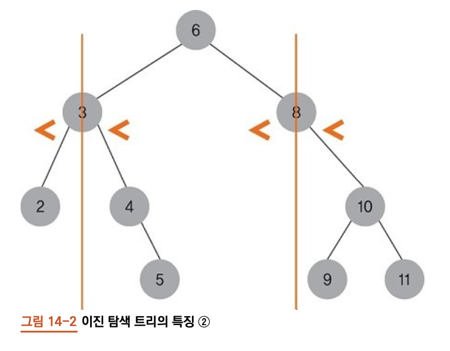

## 14.2 이진 탐색 트리의 구현

- `이진 탐색 트리`는, `이진 트리의 일종`이므로 `IS-A` 이다.

### 14.2.1 이진 탐색 트리의 추상 자료형

- 1. `BST.insert(data)` -> None
    - 데이터 삽입
- 2. `BST.search(target)` -> node
    - 대상 데이터를 가진 노드를 반환. 데이터가 없으면 None
- 3. `BST.remove(target)` -> node
    - 대상 데이터가 있다면, 데이터를 가진 노드를 삭제하면서 반환. 없으면 None
- 4. `BST.insert_node(node)` -> None
    - 데이터가 아니라 노드 삽입. remove에서 반환받은 노드의 데이터를 수정 후 다시 삽입.
    
### 14.2.2 이진 트리 관련 메서드

<이진트리를 상속하면 편하나, 편의를 위해 필요 메서드만 다시구현>

```python
# 앞서 13장에서 만든 binary_tree를 상속받으면 좋으나, 편의를 위해 이번엔 상속하지 않고 짜보겠음
from binary_tree import *

class BST:
    
    def __init__(self):
        self.root = None
        
    def get_root(self):
        return self.root
    

    def preorder_traverse(self, cur, f):
        if not cur:
            return
    
        f(cur.data)
        self.preorder_traverse(cur.left, f)
        self.preorder_traverse(cur.right, f)
```

### 14.2.3 insert() 메서드

- 1. `삽입`하려는 데이터를 `루트 노드부터 시작`해 `차례대로 비교`해서 내려감
- 2. `데이터`가 `작으면 왼쪽`, `크면 오른쪽`으로 내려감

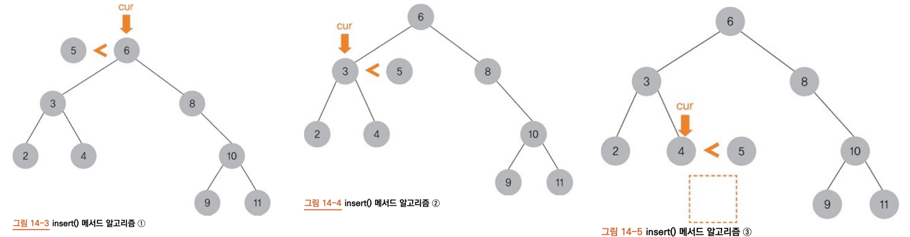

```python
    def insert(self, data):
        # 삽입할 노드 생성 및 데이터 설정
        new_node = TreeNode()
        new_node.data = data
        
        cur = self.root
        # 루트 노드가 없을 때
        
        if cur == None:
            self.root = new_node
            return
        
        #삽입할 노드의 위치를 찾아 삽입
        while True:
            # parent는 현재 순회 중인 노드의 부모 노드를 가리킴
            parent = cur
            # 삽입할 데이터가 현재 노드 데이터보다 작을 때
            if data < cur.data:
                cur = cur.left
                # 왼쪽 서브 트리가 None이면 새 노드를 위치시킨다.
                if not cur:
                    parent.left = new_node
                    return
            # 삽입할 데이터가 현재 노드 데이터보다 클 때
            else:
                cur = cur.right
                # 오른쪽 서브 트리가 None이면 새 노드를 위치시킨다.
                if not cur:
                    parent.right = new_node
                    return
    
```

### 14.2.4 search() 메서드

- insert() 메서드와 유사. (대상 데이터를 루트 노드부터 비교하면서 내려옴)
- `노드의 데이터`가 대상 `데이터와 같다`면 노드를 `반환`

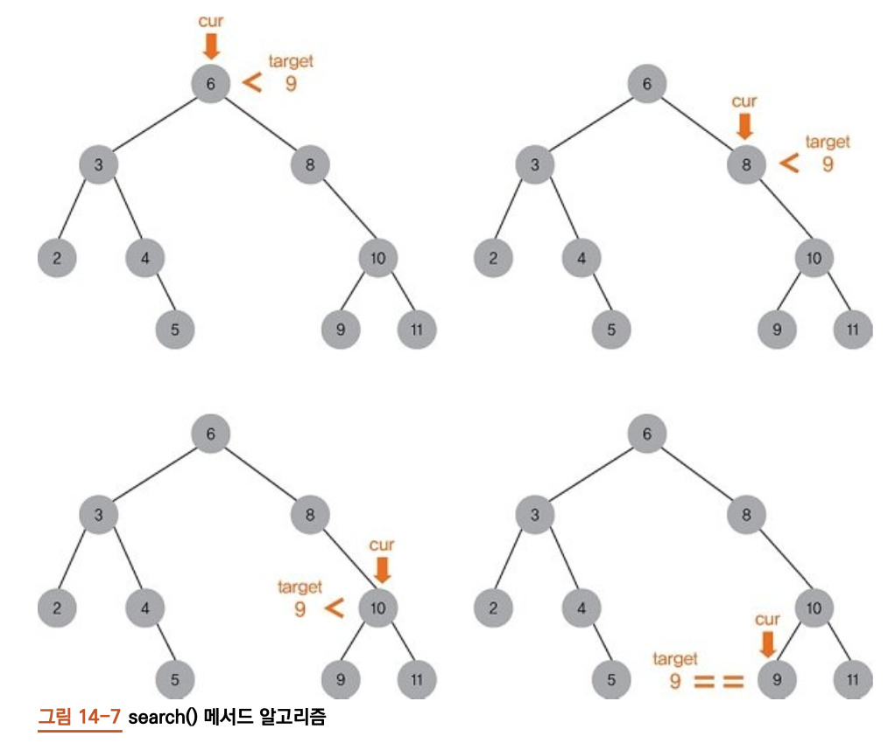

```python
    def search(self, target):
        cur = self.root

        while cur:
            # 대상 데이터를 찾으면 노드를 반환
            if target == cur.data:
                return cur

            # 대상 데이터가 노드 데이터보다 작으면
            # 왼쪽 자식 노드로 이동
            elif target < cur.data:
                cur = cur.left

            # 대상 데이터가 노드 데이터보다 크면
            # 오른쪽 자식 노드로 이동
            elif target > cur.data:
                cur = cur.right

        # while 문을 빠져나온 경우
        # 대상 데이터가 트리 안에 없다.
        return cur
    

```

### 14.2.5 remove() 메서드

- 재귀 함수를 사용해 구현
    - 1) 삭제 노드가 `리프 노드`일 때
    - 2) 삭제 노드의 `자식 노드가 하나`일 때
    - 3) 삭제 노드의 `자식 노드가 두 개`일 때
    
    


---    

```python
# remove() 메서드 코드

    def remove(self, target):
        # 루트 노드의 변경 가능성이 있으므로
        # 루트를 업데이트해야 한다.
        
        self.root, removed_node = self.__remove_recursion(self.root, target)
        
        # 삭제된 노드의 자식 노드를 None으로 만든다.
        removed_node.left = removed_node.right = None
        return removed_node
        
```
---
- `__remove_recursion()`메서드는 메서드를 호출한 노드를 루트 노드로 하여 대상 노드를 삭제후 트리의 업데이트된 루트 노드와 삭제된 노드를 반환
- `remove()` 메서드가 `삭제된 노드를 반환`하는 이유는 => insert_node() 메서드를 통해 `트리에 다시 삽입할 수 있기` 때문.

### __remove_recursion 메서드
---
```python
#__remove_recursion 메서드

    def __remove_recursion(self, cur, target):
        # 탈출 조건 1
        # 대상 데이터가 트리 안에 없을 때
        if cur == None:
            return None, None

        # 대상 데이터가 노드 데이터보다 작으면
        # 노드의 왼쪽 자식에서 대상 데이터를 가진 노드를 지운다(재귀 함수 호출)
        
        elif target < cur.data:
            cur.left, rem_node = self.__remove_recursion(cur.left, target)
        
        # 대상 데이터가 노드 데이터보다 크면
        # 노드의 오른쪽 자식에서 대상 데이터를 가진 노드를 지운다(재귀 함수 호출)
        
        elif target > cur.data:
            cur.right, rem_node = self.__remove_recursion(cur.right, target)
            
        # 탈출 조건 2
        # target == cur.data
        else:
            # 1. 리프 노드일 때
            if not cur.left and not cur.right:
                rem_node = cur
                cur = None
            # 2-1 자식 노드가 하나일 때: 왼쪽 자식이 있을 때
            elif not cur.right:
                rem_node = cur
                cur = cur.left
                
            # 2-2 자식 노드가 하나일 때: 오른쪽 자식이 있을 때
            elif not cur.left:
                rem_node = cur
                cur = cur.right
                
            # 3. 자식 노드가 두 개일 때
            else:
                #4. 대체 노드를 찾는다.
                replace = cur.left
                while replace.right:
                    replace = replace.right
                #5. 삭제 노드와 대체 노드의 값을 교환한다.
                cur.data, replace.data = replace.data, cur.data
                #6. 대체 노드를 삭제하면서 삭제된 노드를 받아온다,.
                cur.left, rem_node = self.__remove_recursion(cur.left, replace.data)
                
            # 삭제 노드가 루트 노드일 경우
            # 루트가 변경될 수 있기 떄문에
            # 삭제 후 현재 루트를 반환
            return cur, rem_node
                
```
---

- `탈출 조건`은 대상 `데이터가 트리 안에 없거나`, `대상 데이터를 찾았을 때`

### __remove_recursion 메서드 스택 프레임

- 유저 프로그래머가 remove(2)를 호출시 => __remove_recursion(2))가 호출된다.

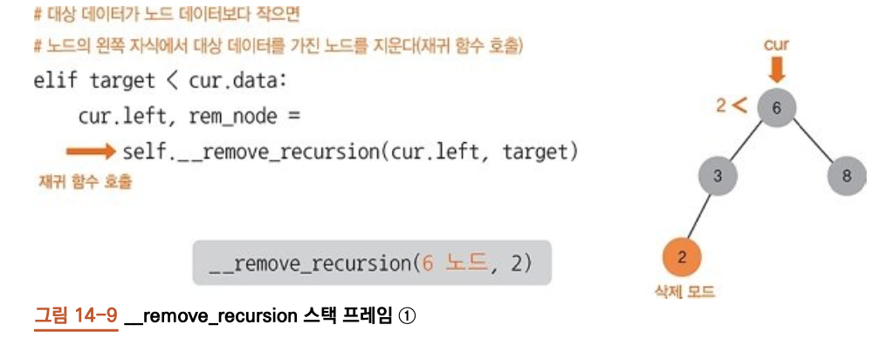

- 데이터 2가 6보다 작으므로 현재 노드의 왼쪽 자식 노드를 인자로 전달, 다시함수 호출

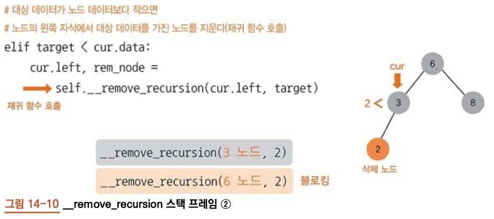

- 2가 3보다 작으므로 다시 함수 호출

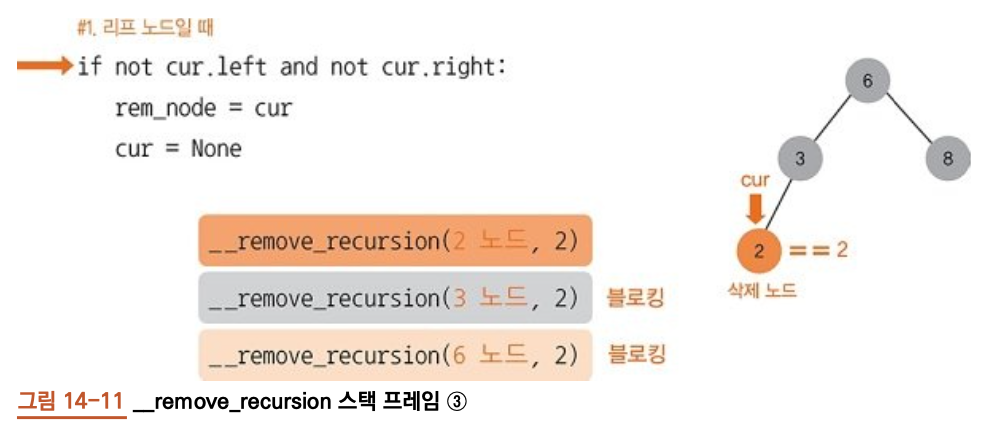

- 데이터 2가 2와 같으므로, `탈출조건` 만족, `cur = None`, `rem_node = 2` 노드를 담아 `튜플`로 반환

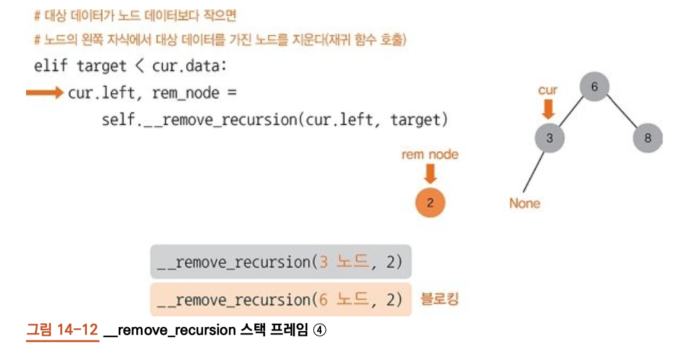

- `(None, 2)`를 각각 `cur.left`, `rem_node` 변수에 할당. 2 노드는 3노드의 왼쪽 노드가 아니다.

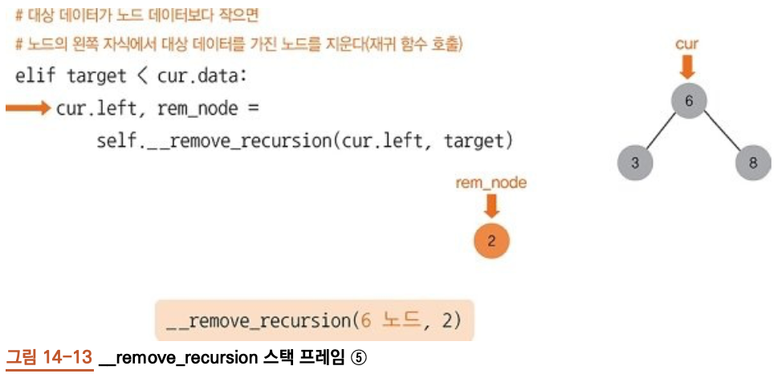

- (3, 2)를 6노드의 left, rem_node에 할당. `이미 참조하고 있으므로 아무변화 x`

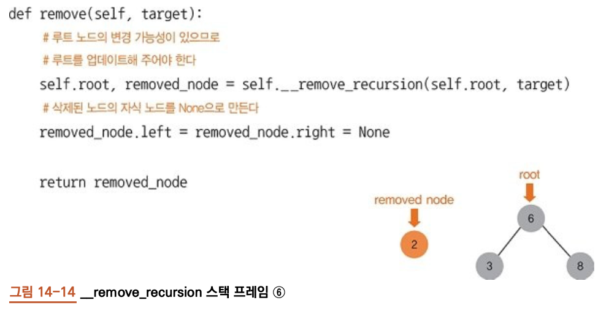

- remove() 메서드에 (6, 2)를 반환. remove() 메서드에 6 노드가 root로 할당됨. 아무변화 x, 
- removed_node에 할당된 2 노드는 자식 노드를 정리한 뒤 유저 프로그래머에게 반환

<예제 트리의 구성>
```python
if __name__ == "__main__":
    bst = BST()
    
    # insert
    
    bst.insert(6)
    bst.insert(3)
    bst.insert(2)
    bst.insert(4)
    bst.insert(5)
    bst.insert(8)
    bst.insert(10)
    bst.insert(9)
    bst.insert(11)
    
    
    

    f = lambda x: print(x, end = " ")

    bst.preorder_traverse(bst.get_root(), f)
    print()
    
    
>>> 6 3 2 4 5 8 10 9 11
```
---
<리프 노드의 삭제>
```python
bst.remove(9)
bst.preorder_traverse(bst.get_root(), f)
>>> TreeNode of 9 is deleted
>>> 6 3 2 4 5 8 10 11
```

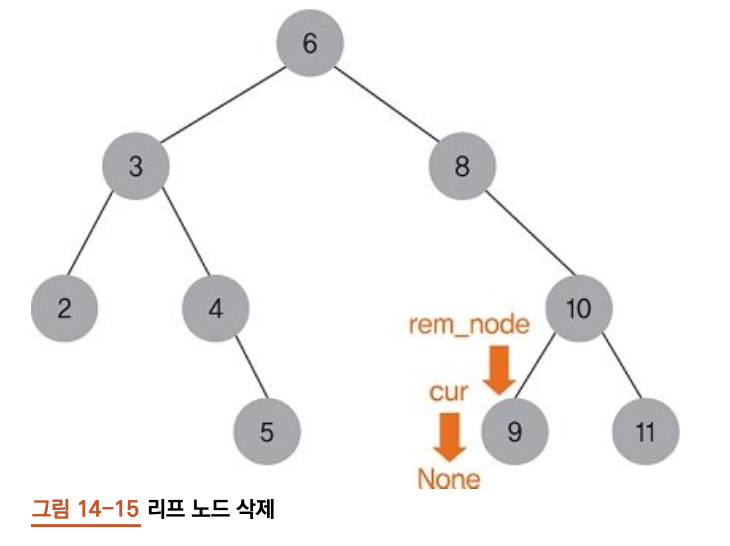

- rem_node가 cur을 참조, cur에 None을 할당
- `cur이 None`이 되어, 업데이트될 10의 왼쪽 자식노드는 `None`
---

---
<자식이 하나 있는 노드의 삭제>
```python
bst.remove(8)
bst.preorder_traverse(bst.get_root(), f)
>>> TreeNode of 8 is deleted
>>> 6 3 2 4 5 10 9 11
```
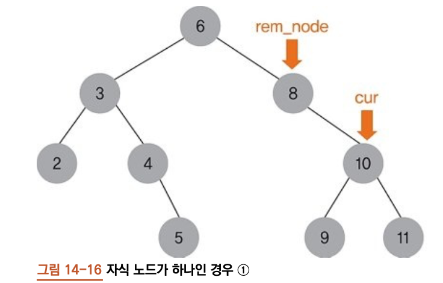
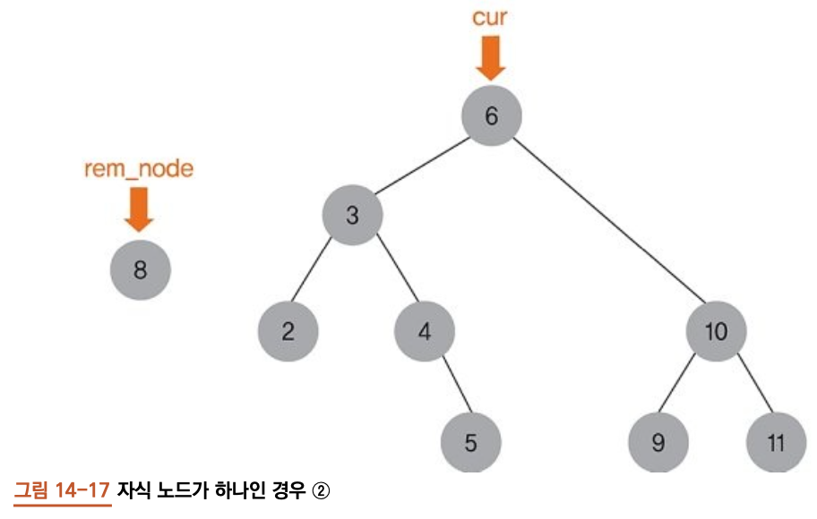

- cur을 rem_node에 미리 할당하고,
- 반환되어 업데이트에 쓰일 cur은 cur의 right를 참조하게 합니다.
- (10, 8)를 각각, cur.right, rem_node에 할당 => 스택 프레임의 cur은 6노드 이므로
- 6의 오른쪽 노드에 10노드가 할당. `탐색 트리 특징 유지!!`

---

<자식이 둘인 노드의 삭제>
```python
bst.remove(6)
bst.preorder_traverse(bst.get_root(), f)
>>> TreeNode of 6 is deleted
>>> 5 3 2 4 8 10 9 11
```

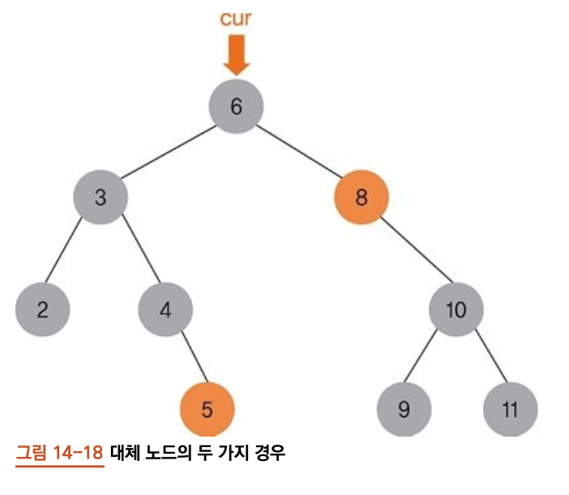

- 삭제노드의 `자식 노드가 2개` 일때는, `대체할 노드`를 찾고, `대체 노드`와 삭제 노드의 `데이터 교체`
- 이진 탐색 트리를 유지하기 위해:
    - 1. 왼쪽 서브트리에서 가장 큰 데이터
    - 2. 오른쪽 서브트리에서 가장 작은 데이터
- 데이터 교체 후, 대체 노드를 이젠 탐색 트리에서 삭제


### insert_node() 메서드

- remove() 메서드에서 반환받은 삭제 노드를 수정한 다음, 이진 탐색 트리에 다시 삽입 메서드

```python
    def insert_node(self, node):
    #노드 생성 코드 없음
    #노드 생성에 따른 부담을 덜 수 있다

    cur = self.root

    #insert() 메서드와 다른 점
    #new_node -> node
    if cur == None:
        self.root = node
        return

    while True:
        parent = cur
        #insert() 메서드와 다른 점
        #data->node.data
        if node.data < cur.data:
            cur = cur.left
            if not cur:
                #insert() 메서드와 다른 점
                #new_node -> node
                parent.left = node
                return
        else:
            cur = cur.right
            if not cur:
                #insert() 메서드와 다른 점
                #new_node -> node
                parent.right = node
                return
```

- 인자로 데이터 대신 노드를 받음
- 객체 생성에 따른 부담을 줄일 수 있음.

```python

#이진 탐색 트리에서 6 노드를 삭제
node = bst.remove(6)

#반환받은 삭제 노드의 데이터를 7로 변경
node.data = 7

# 변경된 노드를 이진 탐색 트리에 다시 삽입
bst.insert_node(node)

#기대 출력 값: 5 3 2 4 8 7 10 9 11
bst.preorder_traverse(bst.get_root(), f)
print()

>>> 5 3 2 4 8 7 10 9 11

```


--- 
## 전체 코드
```python
from binary_tree import *

class BST:
    #1. 이진 트리와 같음
    def __init__(self):
        self.root = None
    #2. 이진 트리와 같음
    def get_root(self):
        return self.root
    #3. 이진 트리와 같음
    def preorder_traverse(self, cur, f):
        if not cur:
            return

        f(cur.data)
        self.preorder_traverse(cur.left, f)
        self.preorder_traverse(cur.right, f)
        
    def insert(self, data):
        #삽입할 노드 생성 및 데이터 설정
        new_node = TreeNode()
        new_node.data = data

        cur = self.root
        #루트 노드가 없을 때
        if cur == None:
            self.root = new_node
            return

        #삽입할 노드의 위치를 찾아 삽입
        while True:
            #parent는 현재 순회 중인 노드의 부모 노드를 가리킴
            parent = cur
            #삽입할 데이터가 현재 노드 데이터보다 작을 때
            if data < cur.data:
                cur = cur.left
                #왼쪽 서브 트리가 None이면 새 노드를 위치시킨다.
                if not cur:
                    parent.left = new_node
                    return
            #삽입할 데이터가 현재 노드 데이터보다 클 때
            else:
                cur = cur.right
                #오른쪽 서브 트리가 None이면 새 노드를 위치시킨다. 
                if not cur:
                    parent.right = new_node
                    return

    def search(self, target):
        cur = self.root
        
        while cur:
            #target 데이터를 찾으면 노드를 반환
            if target == cur.data:
                return cur
            #target 데이터가 노드 데이터보다 작으면
            #왼쪽 자식 노드로 이동
            elif target < cur.data:
                cur = cur.left
            #target 데이터가 노드 데이터보다 크면
            #오른쪽 자식 노드로 이동
            elif target > cur.data:
                cur = cur.right
        #while 문을 빠져나온 경우
        #target 데이터가 트리 안에 없다.
        return cur

    def __remove_recursion(self, cur, target):
        #탈출 조건 1
        #대상 데이터가 트리 안에 없다.
        if cur == None:
            return None, None
        #대상 데이터가 노드 데이터보다 작으면
        #노드의 왼쪽 자식에서 대상 데이터를 가진 노드를 지운다.(재귀 함수 호출)
        elif target < cur.data:
            cur.left, rem_node = \
                self.__remove_recursion(cur.left, target)
        #대상 데이터가 노드 데이터보다 크면
        #노드의 오른쪽 자식에서 대상 데이터를 가진 노드를 지운다.(재귀 함수 호출)
        elif target > cur.data:
            cur.right, rem_node = self.__remove_recursion(cur.right, target)
        #탈출 조건 2
        #target == cur.data    
        else:
            #1. 리프 노드일 때
            if not cur.left and not cur.right:
                rem_node = cur
                cur = None
            #2-1. 자식 노드가 하나일 때: 왼쪽 자식이 있을 때
            elif not cur.right:
                rem_node = cur
                cur = cur.left
            #2-2. 자식 노드가 하나일 때: 오른쪽 자식이 있을 때
            elif not cur.left:
                rem_node = cur
                cur = cur.right
            #3. 자식 노드가 두개일 때
            else:
                #4. 대체노드를 찾는다.
                replace = cur.left
                while replace.right:
                    replace = replace.right
                #5. 삭제 노드와 대체 노드의 값을 교환한다.
                cur.data, replace.data = replace.data, cur.data
                #6. 대체 노드를 삭제하면서 삭제된 노드를 받아온다.
                cur.left, rem_node = self.__remove_recursion(cur.left, replace.data)
        #삭제 노드가 루트 노드일 경우
        #루트가 변경될 수 있기 때문에
        #삭제 후 현재 루트를 반환 
        return cur, rem_node
                
    def remove(self, target):
        #루트 노드의 변경 가능성이 있으므로
        #루트를 업데이트 해주어야 한다.
        self.root, removed_node = self.__remove_recursion(self.root, target)
        #삭제된 노드의 자식 노드를 None으로 만든다
        removed_node.left = removed_node.right = None
        
        return removed_node

    #인자가 데이터가 아니라 노드이다.
    #insert() 메서드에서
    #노드 생성 코드만 빼면
    #코드 흐름은 완전히 같다.
    def insert_node(self, node):
        #노드 생성 코드 없음
        #노드 생성에 따른 부담을 덜 수 있다

        cur = self.root

        #insert() 메서드와 다른 점
        #new_node -> node
        if cur == None:
            self.root = node
            return

        while True:
            parent = cur
            #insert() 메서드와 다른 점
            #data->node.data
            if node.data < cur.data:
                cur = cur.left
                if not cur:
                    #insert() 메서드와 다른 점
                    #new_node -> node
                    parent.left = node
                    return
            else:
                cur = cur.right
                if not cur:
                    #insert() 메서드와 다른 점
                    #new_node -> node
                    parent.right = node
                    return
```

## 테스트 코드
```python
if __name__ == "__main__":
    bst = BST()
    
    #insert
    bst.insert(6)
    bst.insert(3)
    bst.insert(2)
    bst.insert(4)
    bst.insert(5)
    bst.insert(8)
    bst.insert(10)
    bst.insert(9)
    bst.insert(11)
    
    
    f = lambda x: print(x, end = '  ')

    
    #전위 순회
    bst.preorder_traverse(bst.get_root(), f)
    print()
```
