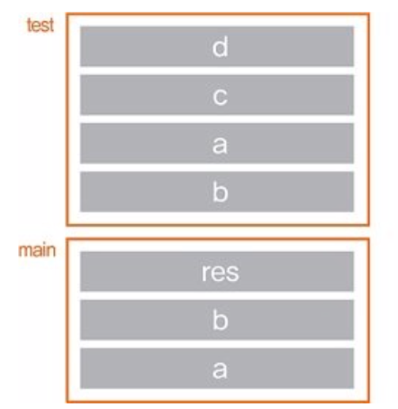

# 5장. Function
- 스택: 접시 쌓기, 마지막에 들어온 데이터가 가장 먼저 나가는 구조

## 1. 전역 변수와 지역 변수
- 전역변수(global variable): 전체 영역에서 접근할 수 있는 변수, 함수안에서도 접근가능
- 지역변수(local vairable): 특정 지역(함수 내부) 안에서만 접근할 수 있는 변수


- `global` 키워드를 사용하여 함수안에서 전역변수를 변경할 수 있다.
---
```python
g_var = 10 #1

def func():
    global g_var #2
    g_var = 20
    
if __name__ == "__main__":
    print("g_var : {} before".format(g_var)) #3
    func()
    print("g_var : {} after".format(g_var))
```
    `g_var : 10 before`
    `g_var : 20 after` #4

- 전역변수 #1 선언후, 
- 함수안에서 g_var값의 변경을 시도 #2
- 전역 변수가 함수 안에서 변경되었는지 출력하여 확인 #3
- 함수를 호출한 쪽에서 변경되었는지 확인 #4
---


## 2. nonlocal 키워드
- 내부함수에서 다른 함수를 정의할 때 쓰는방법

```python
def outer():  
    a = 2 #1
    b = 3
    
    def inner():
        nonlocal a #2
        a = 100 #3
    inner()
    
    print(
    "locals in outer : a = {}, b = {}".format(a, b))

if __name__ == "__main__":
    outer()
```

    'locals in outer : a = 100, b = 3
    
- #2에서 nonlocal 키워드로 inner() 함수 안에서 outer() 함수의 지역변수 a를 사용할것으로 선언


## 3. 인자 전달 방식에 따른 분류

###3.1 값에 의한 전달(call by value) 
- 파이썬에서는 없는 개념

---
```c++
#include <iostream>
using namespace std;

void change_value(int x, int value) // #1
{
    x = value; // #2
    cout << "x : " << x << " in change_value" << endl;
    
}

int main(void)
{
    int x = 10;  // #3
    change_value(x, 20);  //#4
    cout << "x : " << x << " in main" << endl;
    
    return 0;
    
}

```
    `x : 20 in change_value`
    `x : 10 in main`
---


---
```c++
#include <iostream>
using namespace std;

int test(int a, int b);

int main(void)
{
    int a = 10, b = 5; // #4
    int res = test(a, b); // %5
    cout << "result of test: " << res << endl;
    return 0;
}

int test(int a, int b) // # 1
{
    int c = a + b; // #2
    int d = a - b; // #3
    return c + d;
}
---
- 결과 값은 다음 이미지와 함께보자



