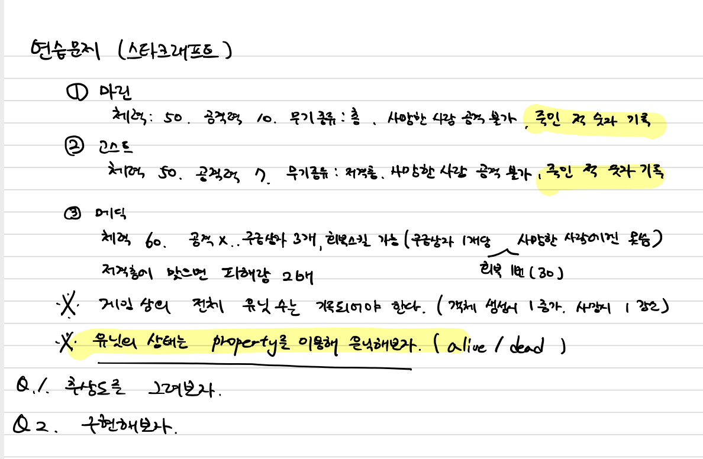
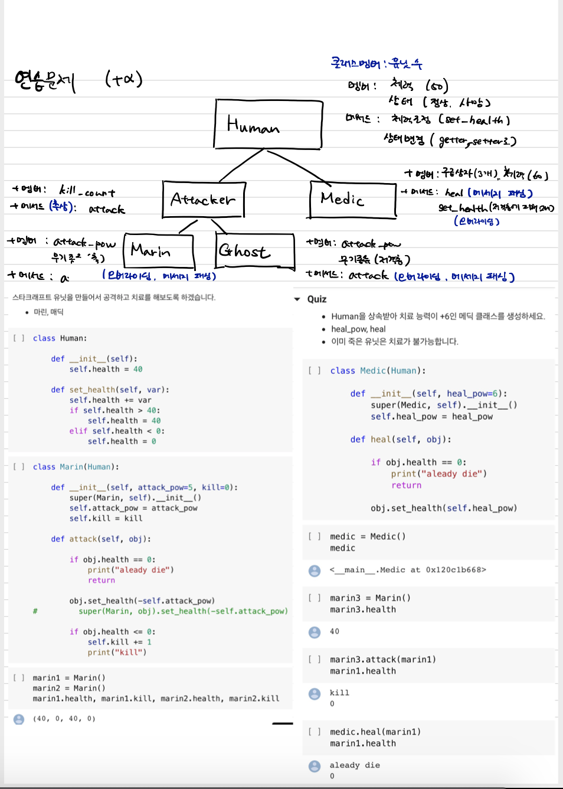
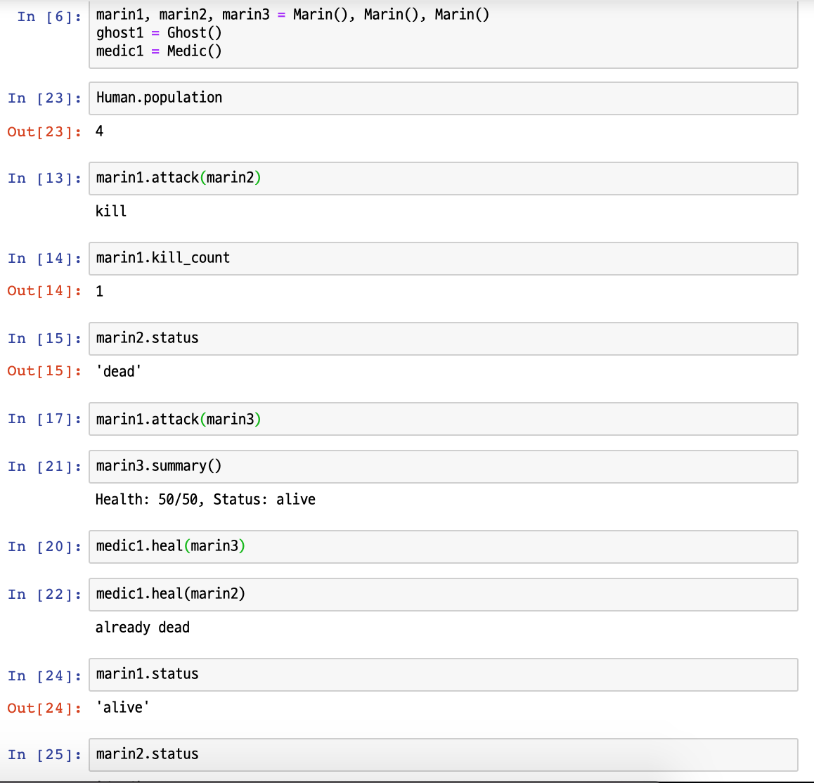

# 7장. Class
- 프로그램이 실행되었을 때 생성되는 객체가 어떤 멤버변수와 메소드를 가지는지 정의해둔 것 (출처: https://offbyone.tistory.com/)

## 1. 클래스 관계

### 1.1 Is-A : 상속(inheritance)
- `~은 ~의 한 종류다`
- 상속하는 클래스를 `부모(parent)`, `슈퍼(super)`라고 하고
- 상속받는 클래스를 `자식(child)`, `서브(sub)`라고 함
- 어떤 객체가 다른 객체의 모든 a)멤버 b)메서드 를 가진 상태 + 다른 특성 기능을 가지고있을경우 상속


```python
class Computer:
    def __init__(self, cpu, ram):
        self.CPU = cpu
        self.RAM = ram
        
    def browse(self):
        print("browse")
        
    def work(self):
        print("work")
```


```python
class Laptop(Computer): #1
    # 멤버 추가
    def __init__(self, cpu, ram, battery):
        super().__init__(cpu,ram) #2
        self.battery = battery #3
    #메서드 추가
    def move(self, to): #4
        print("move to {}".format(to))

```
- 1. Laptop 은 Computer의 모든 기능을 포함함. 즉 A laptop is a computer 성립
- #1 을 통해 Computer를 상속받음
- #2 기본 클래스의 생성자 초기화, #3 battery만 할당, #4 move() 메서드 추가


### 1.2 HAS-A : 합성 또는 통합
- `~이 ~을 가진다`
- A Computer HAS-A CPU, A pliceman HAS-A gun
- HAS-A 관계는 1.`합성(composition)`: Computer, CPU관계, Computer가 폐기될 때, CPU도 함께 폐기
- 2.`통합(aggregation)`: 생명주기를 같이 하지 않음.

```python

class Gun:
    def __init__(self, kind):
        self.kind = kind
    def bang(self):
        print("bang bang!")
        
        
class Police:
    def __init__(self):
        self.gun = None #1
   
    def acquire_gun(self, gun): #2
        self.gun = gun
        
    def release_gun(self): #3
        gun = self.gun
        self.gun = None
        return gun
    
    def shoot(self):
        if self.gun:
            self.gun.bang()
        else:
            print("Unable to shoot")
    

    
    
if __name__ == "__main__":
    p1 = Police() #4
    print("p1 shoots")
    p1.shoot()
    print("")
    
    # p1은 아직 총을 소유x
    revolver = Gun("Revolver")
    # p1이 revolver를 획득
    p1.acquire_gun(revolver) #5
    # p1이 리볼버 소유, revolver는 None

    print("p1 shoots again")
    p1.shoot()
    print("")
    
    # p1이 총반납, 더이상 총 소유 x
    revolver = p1.release_gun()
    print("p1 shoots again")
    p1.shoot()


```
- #1 Police instace가 생성될 때, Gun 객체를 가지고 있지 않지만 #2를 통해 Gun객체를 멤버로 가지게됨 `(HAS-A관계)`
- #4 Police instance가 생성되었을때는 gun 소유x , #5 총을 소유 (쏘기가능), #6 relese경우 총쏘기 불가


## 2. 메서드 오버라이딩과 다형성
 
- `오버라이딩`: 파생 클래스에서 상속받은 메서드를 다시 구현하는 것
- `다형성`: 상속 관계에 있는 다양한 클래스의 객체에서 같은 이름의 메서드를 호출하는 것


```python
class CarOwner:
    def __init__(self, name):
        self.name = name
        
    def concentrate(self):
        print("{} can not do anything else".format(self.name))
        
class Car:
    def __init__(self, owner_name):
        self.owner = CarOwner(owner_name)
        
    def drive(self): #1
        self.owner.concentrate() #2
        print("{} is driving now.".format(self.owner.name)) #3
        
class SelfDrivingCar(Car):
    def drive(self):#4
        print("Car is driving by itself") #5

#실행        
if __name__ == "__main__":
    car = Car("Greg")
    car.drive() #6
    print("")
    
    s_car = SelfDrivingCar("John")
    s_car.drive() #7

```
    Greg can not do anything else #8
    Greg is driving now.
    
    Car is driving by itselt #9

- #4 Car 클래스를 상속하되, 상속받은 메서드를 다시 구현하는것을 `메서드 오버라이딩` 이라고 함
- #6, #7 같은 이름의 메서드를 호출해도, 호출한 객체에 따라 다른 결과를 내는것을 `다형성` 이라고 합니다. 


## 3. 클래스 설계
`주의점!`
- 공통 부분을 기본 클래스로 묶는다.
- 부모가 추상 클래스 제외, 자녀 클래스에서 부모 클래스의 메서드를 여러차례 오버라이딩시, 파생클래스 x


## 4. 연산자 오버로딩
- `연산자 오버로딩(operator overloading)`은 클래스 안에서 메서드로 연산자를 새롭게 구현하는 것. `다형성`의 특별한 형태
- 객체나 일반적인 피연산자와 연산하는것이 가능해진다.


```python
class Point:
    def __init__(self, x = 0, y = 0):
        self.x = x
        self.y = y
        
    def set_point(self, x, y):
        self.x = x
        self.y = y
        
    def get_point(self):
        return self.x, self.y
    
    def __str__(self):
        return "({x}, {y})".format(x = self.x, y = self.y)
    
    # 더하기 연산자(+) 오버로딩
    
    def __add__(self, n): #1
        x = self.x + n
        y = self.y + n
        return Point(x, y)
    
    def __radd__(self, n): #2
        x = self.x + n
        y = self.y + n
        return Point(x, y)
    
    
    
if __name__ =="__main__":
    p1 = Point(2, 2)
    p2 = p1 + 3 #3
    p3 = 3 + p1 #4
    
    
    
print(p2)
print(p3)
```

- #1 추가 안해줄 경우, #3이 에러가 납니다, 추가시 p2 = p1+3을 만날시, __add__()를 호출하여 p1.__add__(3)변경되어 정상 작동
- #2 를 추가 안해줄 경우 #4 가 에러납니다. 추가시 위와 동일한 원리로 작동
- `add`, `sub`, `mul`, `truediv`, `floordiv` 등 여러 메서드는 문법책 참고

## 5. 클래스 만들어보기


### 5.1 예시


### 5.2 답
---
```python
# Human class
class Human:
    population = 0
    
    def __init__(self, max_health = 50):
        self.max_health = max_health
        self.health = max_health
        self.status = "alive"
        Human.population += 1
        
    def set_health(self, var, attack_kind):
        self.health += var
        if self.health > self.max_health:
            self.health = self.max_health
        elif self.health <= 0:
            self.health = 0
            self.status = "dead"
        
    @property
    def status(self):
        return self.__status
    
    @status.setter
    def status(self, stat):
        if stat in ("alive", "dead"):
            self.__status = stat
        if stat == "dead":
            Human.population -= 1
            
    def summary(self):
        print("Health: {}/{}, Status: {}".format(self.health, self.max_health, self.status))
```
---

---
```python
# Attacker class
from abc import *

class Attacker(Human, metaclass = ABCMeta):
    
    def __init__(self, attack_pow = None, attack_kind = None):
        super().__init__()
        self.attack_kind = attack_kind
        self.attack_pow = attack_pow
        self.kill_count = 0

    @abstractmethod
    def attack(self, other):
        pass
```
---

---
```python

class Marin(Attacker):
    def __init__(self, attack_pow = 10, attack_kind = "rifle"):
        super().__init__()
        self.attack_kind = attack_kind
        self.attack_pow = attack_pow
        
    def attack(self, obj):
        if obj.status == "dead": # 이미 객체가 죽어있으면
            print("already dead")
            return
        
        obj.set_health(-self.attack_pow, self.attack_kind) # 객체를 공격한다
        if obj.status == "dead": # 객체가 죽었으면
            self.kill_count += 1 # 킬 카운트를 1 늘려주고
            print("kill")
```
---


---
```python
class Ghost(Attacker):
    def __init__(self, attack_pow = 7, attack_kind = "sniper rifle"):
        super().__init__()
        self.attack_kind = attack_kind
        self.attack_pow = attack_pow
        
    def attack(self, obj):
        if obj.status == "dead": # 이미 객체가 죽어있으면
            print("already dead")
            return
        
        obj.set_health(-self.attack_pow, self.attack_kind) # 객체를 공격한다
        if obj.status == "dead": # 객체가 죽었으면
            self.kill_count += 1 # 킬 카운트를 1 늘려주고
            print("kill")
```
---


---
```python
class Medic(Human):
    def __init__(self, max_health = 60):
        super().__init__()
        self.max_health = max_health
        self.health = max_health
        self.heal_box = 3
        self.heal_pow = 30
        
    def set_health(self, var, attack_kind):
        if attack_kind == "sniper rifle":
            var *= 2        
        self.health += var
        if self.health > self.max_health:
            self.health = self.max_health
        elif self.health <= 0:
            self.health = 0
            self.status = "dead"
            
    def heal(self, obj):
        if obj.status == "dead":
            print("already dead")
            return
        if self.heal_box <= 0:
            print("Don't have heal box")
            return
        obj.set_health(self.heal_pow, "heal")
        self.heal_box -= 1
```
---

### 클래스 생성후 활용

7_class_practice_3.png
