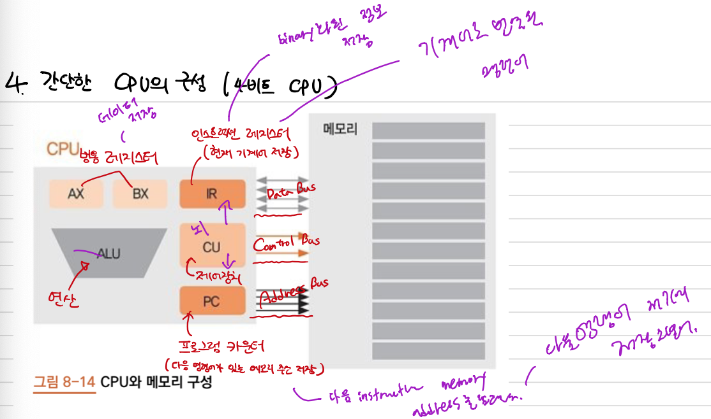
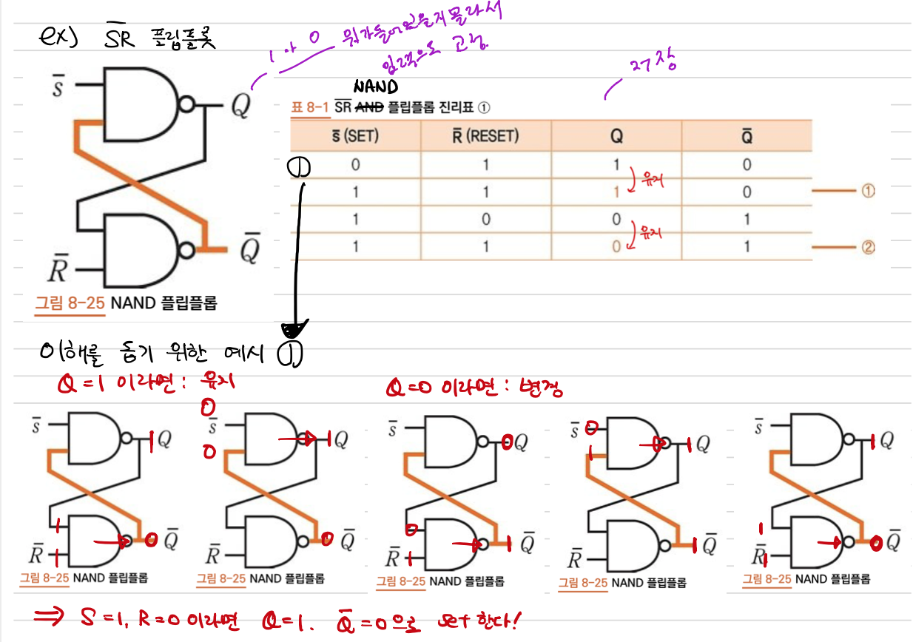
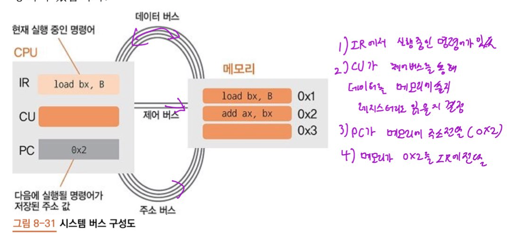

# 8장. CPU
---
## 1. 트랜지스터와 논리 게이터
---
### 1.1 전압, 전류, 저항
- `전압강하` : 저항을 지나면서 전압이 낮아지는 것
- `트랜지스터`: 스위치 역할을 하여 전압 강하를 조절, 이를통해 이진수 0,1 조절
---
---
### 1.2 논리 게이트
- `bool` 함수를 구현하기 위한 회로 (AND, OR, XOR, NOT)등이 있다.

- reference: Electronics : Logic Gate Worksheets and Answers by will2share_kam
---

### 2.1 CPU의 구성

- `CU`(Control Unit) : 우리가 작성한 코드를 해석하고, CPU의 각 파트에 지시를 내림
- `ALU`(Arithmetic Logic Unit) : 4칙연산, AND, OR등 논리연산을 하는곳
- `AX`, `BX`, `IR`, `PC` : 레지스터, CPU안에 내장된 메모리
- `조합 논리 회로` : 현재 입력에 의해서만 출력이 결정되는 논리 회로
---

### 2.2 가산기

- `전가산기` : `반가산기 두개` 와 `OR` 게이트로 이루어져있다.
- `반가산기` : `XOR`게이트와 `AND` 게이트 한개씩만 있으면 생성가능
- `ALU` 연산은 현재 출력이 오로지 현재 입력에 의해서만 결정됨

---
## 3. 순차 논리 회로와 레지스터
- 순차 논리 회로(Sequential Logic Circuit)는 현재의 출력이 현재의 입력과 과거의 출력에 따라 정해짐

- 먼저 출력이 분기되어 다시 입력으로 돌아옵니다. NAND 게이트의 입력이 됩니다.
- $\frac{}{S}$ 와 $\frac{}{R}$ 이 특정한 값일 때만 Q와 $\frac{}{Q}$ 이 바뀌는 것이 순차논리의 핵심
- 특정 상황이 되었을 때만 바뀌는 점, 이를 통해 이전 출력값이 유지된다는 특성은 `저장` 된다라고도 표현 가능.
- 이러한 특성으로 인해 `플립플롭`을 `메모리 소자`, 메모리를 구성하는 기본 단위라고 부름

---
## 4. 클록
 
- $f = 2Hz = 2cycle/sec$ : 진자가 1초 동안 왕복한 횟수를 `주파수` 라고 합니다.
- $\tau = \frac{1}{f} = \frac{1}{2} = 0.5sec/cycle$ : 진자가 1초동안 두번 왕복했다 `주기`
- `0.74GHZ` = $0.74 \times 10^9Hz$ : `clock rate`는 CPU 혹은 프로세서 속도의 지표로 1초에 클록이 몇번 발생했는가를 의미. $1/(0.74 \times10^9)sec = 1.35\times10^-9sec$

---
## 5. 시스템 버스

레지스터
- `IR`(Instruction Register) : 메모리에 있는 명령어를 CPU로 가져와 저장해 두는 곳
- `PC`(Program Counter) : 현재 실행 중인 명령어 다음에 실행될 명령어의 메모리 주소보관
- `AX`,`BX` : 범용 레지스터, 메모리에서 읽어들인 데이터를 저장 후 ALU가 연산시 피연산자로 전달 또는 연산결과 값을 저장

---
### 5.1 시스템 버스의 구성과 특징

- `Data Bus` : Control Bus에 따라 데이터를 CPU에서 메모리로 전송, 혹은 메모리에서 CPU로 전송. 양방향
- `Control Bus` : 데이터를 레지스터로 읽어올지, 메모리에 쓸지, CPU가 메모리에 전달
- `Address Bus` : 메모리 -> 레지스터 `or` 레지스터 -> 메모리로 전송시 필요한 메모리 주소 전달. 단방향

---
## 6. 인스트럭션 세트
- `CPU`가 인식하여 실행할 수 있는 기계어
- `어셈블리어` : 기계어를 사람이 읽을 수 있도록 일대일로 대응한 문자형태 명령어

---
### 6.1 명령어 종류

- 앞의 `3bit` 명령어: add, div, store, load 등등이 있다.
- 레지스터를 표현하는 하는 각각 `2bit`. 범용레지스터가 4개이므로 2비트면 된다.
